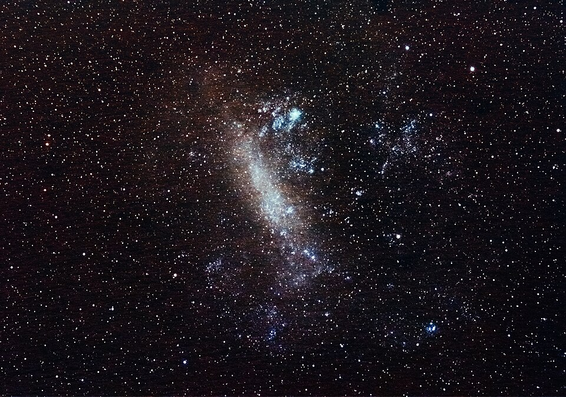

.. _numpy_stars:

NumPy Stars
===========

.. questions::

   - Why use NumPy instead of pure python?
   - How to use basic NumPy?
   - What is vectorization?

.. objectives::

   - Understand the Numpy array object
   - Be able to use basic NumPy functionality
   - Understand enough of NumPy to search for answers to the rest of your questions ;)

.. admonition:: Example context
   :class: demo

   Each lesson is placed inside an example scientific setting.
   In this lesson, we will compute the distance of the stars in our night sky, using the data collected by the Gaia sattelite.
   To follow along, you must download the :download:`data package <https://drive.google.com/file/d/1ZbZIpf-tL60S18k9f8LI_YdTe9o8jy-I/view?usp=sharing>` and unzip it in the ``python-for-scicomp`` folder.

NumPy is the most used library for scientific computing.
Even if you are not using it directly, chances are high that some library uses it in the background.
It helps you work with "data", as in large amounts of numbers, by providing:

1. A high-performance multidimensional array object to store data in computer memory
2. Efficient routines to manipulate data, such as reading and writing, splitting and concatenation, and other transformations
3. Efficient routines to perform computations on data, such as statistics and linear algebra

Let's explore the fundamentals of this foundational library by analyzing some astronomical data and discover the secret of the Large Magallanic Cloud.

.. highlight:: python

Part 1: Exploring our local stellar neighbourhood
-------------------------------------------------

The `Gaia sattelite <https://www.esa.int/Science_Exploration/Space_Science/Gaia>`__ has imaged around 1.8 billion stars and other objects.
Among the things it measured was the "parallax" of each object, which is how much it seems to "move" in relationship to very distant stars as the sattelite traveled around the sun and observed it from different angles.
We can use the amount of parallax to determine how far away a star is.

.. figure:: img/numpy/parsec.png
   :width: 300px
   :align: center

   Visual explanation of the parallax effect. Image `retrieved from WikiMedia <https://commons.wikimedia.org/wiki/File:Stellarparallax_parsec1.svg>`__. Public domain.

A sample of the Gaia data can be found in :download:`../resources/data/numpy/local_stars.csv`.
This is a *comma separated value (CSV)* file, where each line contains 6 numbers describing a single object.
The first line of that file is the "header" indicating the meaning of each number::

    with open("../resources/data/numpy/local_stars.csv") as f:
        # The file handle `f` acts as a generator that yields lines of text.
        first_line = next(f)  # take a single item from the generator
        names = first_line.strip().split(",")  # get a list of individual names
    print(names)

We can use one of NumPy's functions to load the entire file into memory::

    import numpy as np  # we usually use `np` as shorthand
    # We set `skip_header=1` to skip the first line containing the description of the values.
    data = np.genfromtxt("../resources/data/numpy/local_stars.csv", delimiter=",", skip_header=1)
    print(data)

The ``data`` variable is a NumPy array::

   print(type(data))
 

What is an array?
-----------------

An array is a collection of values which are all of the same datatype, tightly packed side-by-side in a continuous chunk of memory.
This is why we had to skip the first line of the file, the one containing ``str`` type descriptions, so that we were only reading numbers.
In our case, the datatype of the resulting array is::

    print(data.dtype)

Arrays can have any number of dimensions, ours has::

    print(data.ndim)

You can think of a 1D array as a *list* and a 2D array as a *table*.
Alternatively, in mathematics, we call a 1D array a *vector*, a 2D array a *matrix*, and an array with 3 or even more dimensions a *tensor*.
An array can even have zero dimensions if it represents a single *scalar* number.
Regardless of how many dimensions the array has, it is always a Python object of type :class:`numpy.ndarray`.

Let's see how many stars we have. The ``.shape`` property of an array contains the size along each dimension::

    print(data.shape)

We have information on more than a million stars, and for each star we have 6 values, corresponding to (see ``names`` above):

0. ``right_ascension``: horizontal position of the star along the celestial equator (degrees)
#. ``declination``: vertical position of the star above/below celestial equator (degrees)
#. ``parallax``: amount the star's position in the sky changes throughout the year
#. ``magnitude_g``: how bright the star appears in our sky (inverse Logarithmic scale)
#. ``magnitude_red``: red-component of the color of the star
#. ``magnitude_blue``: blue-component of the color of the star

Working with arrays
-------------------

Let's compute the distance to some well known stars in our night's sky.
For that, we need to extract the parallax measurements from the ``data`` array, which are in the column with index ``2``.
The way the array is laid out in memory makes it very fast to select portions of the data.
We can index/slice arrays in a similar manner as Python lists using ``[index]``, but we do this separately along each dimension: ``[row_index, col_index]``::

    parallax = data[:, 2]  # `:` is a shorthand for "select everything along this dimension"
    print(parallax)

Now for some basic math.
The parallax values are currently in `milli-arc-seconds <https://en.wikipedia.org/wiki/Minute_and_second_of_arc>`__.
We need to convert that into distance.
A common distance metric is the `"parsec" <https://en.wikipedia.org/wiki/Parsec>`__, which is the distance at which an object has a parallax of exactly one arc-second, which is 3.26156 light-years::

    distance_parsecs = 1 / (parallax / 1000)  # 1000 milli-arc-seconds in an arc-second
    distance_ly = distance_parsecs * 3.26156

Note that we didn't write any ``for``-loops.
In NumPy, arithmetic operations on arrays are applied to every element in that array.
It is very fast, because it is implemented in C or Fortran and makes use of specialized CPU instructions that perform operations on many values at once.
We say an operation is "vectorized" when the looping over elements is carried out by NumPy internally.
Common mathematical operations include: ``+`` (:data:`numpy.add`), ``-`` (:data:`numpy.subtract`), ``*`` (:data:`numpy.multiply`), ``/`` (:data:`numpy.divide`), ``.T`` (:func:`numpy.transpose`), :data:`numpy.sqrt`, :func:`numpy.sum`, :func:`numpy.mean`, ...

.. note::
   In NumPy, ``*`` performs element-wise multiplication and ``@`` performs matrix multiplication. This is different from other languages such as MATLAB or Julia.

Let's examine the closest star in the dataset::

    distance_to_closest_star = distance_ly.min()  # returns the minimum value
    index_of_closest_star = distance_ly.argmin()  # returns the index of the minimum value
    print(distance_to_closest_star, index_of_closest_star)

The closest star is `Proxima Centauri <https://en.wikipedia.org/wiki/Proxima_Centauri>`__ at 4.2465 light-years.
To see all the information we have on it, we can select the entire row using the index we just obtained::

    print(names)  # the column names for reference
    print(data[index_of_closest_star, :])  # select the row corresponding to Proxima Centauri

NumPy has many other ways to select data.
For example, let's see if we can show some information on the 10 stars closest to us.
To do this, we must first order the stars by distance::

    order_by_distance = np.argsort(distance_parsecs)  # argsort returns indices, not values
    closest_indices = order_by_distance[:10]  # select the first 10 elements
    print(closest_indices)

We now have a list (technically a 1D :class:`numpy.ndarray`) of integer indices of the stars closest to us.
We can select multiple rows by indexing the array with such a list::

    closest_stars = data[closest_indices, :] 
    print(distance_ly[closest_indices])

Can we find the `Big Dipper <https://en.wikipedia.org/wiki/Ursa_Major>`__?

   The Big Dipper as seen from Fujian. Image `retrieved from WikiMedia <https://en.wikipedia.org/wiki/Big_Dipper#/media/File:Big_Dipper_20210116.jpg>`__. CC BY license.

It lies within a section of the sky with a `right ascension <https://en.wikipedia.org/wiki/Right_ascension>`__ from 160 to 210 degrees, and a `declination <https://en.wikipedia.org/wiki/Declination>`__ from 45 to 65 degrees::

    right_ascension = data[:, 0]
    declination = data[:, 1]

To select elements from an array based on some condition, we can create an index based on boolean values.
Recall that in Python, comparison operations (``==``, ``<``, ``<=``, ``>``, ``>=``) produce a boolean (``True``/``False``) value.
See what happens when you apply them to an array::

    print(right_ascension > 160)

It produces a new array, of the same dimensions as the original array, but filled with ``True``/``False`` values indicating for each element whether the comparison holds true or not.
We call this a "boolean mask".
We can combine multiple masks using Python's boolean "and" operator ``&``::

    boolean_mask = (
        (right_ascension > 160) &
        (right_ascension < 210) &
        (declination > 45) &
        (declination < 65)
    )

Once you have a boolean mask, you can apply it to any dimension of the array as long as it has the same number of elements as the mask::

    sky_section = data[boolean_mask, :]
    print(sky_section.shape)

In our dataset, there are more than 15k stars in our chosen section of sky.
The Big Dipper should consist of the 7 brightest ones.
The column with index ``3``, named ``magnitude_g``, denotes how bright the star looks as seen by the Gaia sattelite.
The `magnitude scale <https://en.wikipedia.org/wiki/Magnitude_(astronomy)>`__ works "in reverse", such that very bright stars have a magnitude of 1 and weaker stars have a larger magnitude.

.. code::

    # Select the 7 brightest stars in our section of sky.
    order_by_magnitude = np.argsort(sky_section[:, 3])
    brightest_stars = order_by_magnitude[:7]
    big_dipper = sky_section[brightest_stars, :]

    # Make a figure with the position of the stars in the sky. You can take this at face
    # value for now. We will cover how to make figures in a later lesson.
    import matplotlib.pyplot as plt
    fig, ax = plt.subplots()
    ax.scatter(big_dipper[:, 0], big_dipper[:, 1])
    ax.xaxis.set_inverted(True)  # right ascension goes from right-to-left
    ax.set_aspect("equal")
    ax.set_xlabel("right ascension (degrees)")
    ax.set_ylabel("declination (degrees)")

Clever and efficient use of these indexing and mathematical operations is the key to NumPy's speed: you should try to cleverly use these selectors (written in C) to extract data to be used with other NumPy functions written in C or Fortran.
This will give you the benefits of Python with most of the speed of C.

.. seealso::

   :ref:`Numpy basic indexing docs <basics.indexing>`

Exercises 1
-----------

.. challenge:: Exercises: Numpy-1

   Proxima Centauri is part of a 3-star system called `Alpha Centauri <https://en.wikipedia.org/wiki/Alpha_Centauri>`__.
   The other two stars are very close together and appear as a single object (Alpha Centauri AB) in this dataset.
   
   #. What is the row index of the binary star Alpha Centauri AB?
      It is the second closest star to us.
      What is the distance from us to Alpha Centauri AB?
   #. What is the distance from us to the brightest star in the dataset (`Sirius <https://en.wikipedia.org/wiki/Sirius>`__)?
      Remember that a smaller magnitude means a brighter star.
   #. How many stars are there in the dataset that are even brighter than the brightest star in the Big Dipper (`Alioth <https://en.wikipedia.org/wiki/Alioth>`__)?

.. solution:: Solution Numpy-1

   #. Row index: ``alpha_centauri_ind = np.argsort(distance_ly)[1]``. Its distance is ``distance_ly[alpha_centauri_ind]`` = 4.395 light-years.
   #. Brightest star index: ``brightest_ind = np.argsort(data[:, 3])[0]``. Its distance is ``distance_ly[brightest_ind]`` = 8.601 light-years.
   #. The brightest star in the Big Dipper has a magnitude of ``np.min(big_dipper[:, 3])`` = 1.77.
      There are ``data[data[:, 3] < np.min(big_dipper[:, 3])].shape`` = 28 stars in the dataset that are even brighter.

Part 2: Estimating the distance of really far away stars
--------------------------------------------------------

When you are on the southern hemisphere of the Earth, you can see a massive cluster of stars, 20 times wider than the moon:

   The Large Magallanic Cloud. Photographed and edited by Martin Bernard, `retrieved from WikiMedia <https://commons.wikimedia.org/wiki/File:Large_Magellanic_Cloud_100mm.jpg>`__. CC BY-SA license.

Its parallax is so small that even the Gaia satellite cannot reliably measure it, which means it must be pretty far away.
Still, we can estimate its distance, based on a striking relationship between the brightness and the color of a star.
A `Hertzsprung-Russel diagram <https://en.wikipedia.org/wiki/Hertzsprung%E2%80%93Russell_diagram>`__ illustrates this.
Let's make one!

Recall that in our ``data`` array, the column with index ``3`` contains the measurements of the apparent brightness of each star according to Gaia's sensors (``magnitude_g``).
For the Hertzsprung-Russel diagram, we need to estimate their true magnitude (luminosity), compensating for the fact that the further a star is, the dimmer it appears to us.
We will use the formula given in an `official Gaia paper <https://doi.org/10.1051/0004-6361/201832843>`__ for this::

    magnitude_g = data[:, 3]  # apparent magnitude
    magnitude = magnitude_g + 5 * np.log10(parallax) - 10  # true magnitude

The :data:`numpy.log10` function is part of NumPy's vast collection of `ufuncs <https://numpy.org/doc/stable/reference/ufuncs.html#available-ufuncs>`__, which are functions that operate on each element of an array.

In our diagram, we want to show the color of a star on a scale from "very blue" to "very red", with yellow stars in between.
We can compute this by taking the difference between the blue and red components of its color::

    magnitude_blue = data[:, 4]
    magnitude_red = data[:, 5]
    color = magnitude_blue - magnitude_red

Now we have everything we need to make the plot. Again, just take this plotting code at face value for now::

    import matplotlib.pyplot as plt
    plt.figure(figsize=(6, 8))
    plt.scatter(
        color, magnitude, s=1, c=distance_ly, cmap="plasma", alpha=0.1
    )
    cb = plt.colorbar(label="Distance (light years)", fraction=0.05, aspect=40)
    cb.solids.set(alpha=1)  # make the colors in the colorbar not be transparent
    plt.gca().invert_yaxis()  # put bright stars on top, dim stars at the bottom
    plt.title("Hertzsprung-Russell diagram")
    plt.xlabel("Color (Blue ⇨ Red)")
    plt.ylabel("Magnitude")
    plt.tight_layout()

Other than the main sequence stars, you can see the red giants branching off at the top, bright but red, and the white dwarfs at the bottom, very dim but white.

Based on this chart, we can derive a formula to translate the color of a main sequence star (so not a red giant or white dwarf) to its true brightness.
Then, we can compare that true brightness with its apparent brightness to deduce how much dimmer it appears to us than it actually is, hence how far away it must be.

Creating arrays
---------------

The first step is to extract a bunch of ``(color, magnitude)`` pairs along the main sequence, free from outliers.
The strategy is to divide the color spectrum into 100 bins and take the median magnitude in each bin.
With the vast majority of the stars being main sequence stars, the median should be very representative of the general curve of the main sequence.

There are various ways to create an array with equally spaced numbers.
For example, there is the NumPy equivalent of Python's :func:`range` function, :func:`numpy.arange`::

    bins = np.arange(0.1, 4.5, step=0.04)

But for our purposes, :func:`numpy.linspace` is even better::

    n_bins = 100
    bins = np.linspace(0.1, 4.5, num=n_bins)  # 100 numbers evenly spread between 0.1 and 4.5

We could assign stars to their respective color bins using boolean masking, but NumPy offers the :func:`numpy.digitize` function especially for this purpose::

    bin_assignment = np.digitize(color, bins)
    print(bin_assignment)

The function gives for each element of the ``color`` array, the index of the bin it belongs to.
Since each element of the ``color`` array is the color of a star, we have effectively assigned each star to a bin.
Now, we can compute for each bin, the median brightness and color of all the stars in that bin.
We will do this using a ``for`` loop and use a typical pattern for creating NumPy arrays: we first collect the values into a Python list and then convert that list into a NumPy array::

    # We collect the median colors and magnitudes in these lists.
    bin_colors = list()
    bin_magnitudes = list()

    # Loop over all the bins and compute the median color/magnitude.
    for bin_index in np.arange(n_bins):
        bin_color = np.median(color[bin_assignment == bin_index])
        bin_magnitude = np.median(magnitude[bin_assignment == bin_index])
        bin_colors.append(bin_color)
        bin_magnitudes.append(bin_magnitude)

    # Convert the Python lists to NumPy arrays.
    bin_colors = np.array(bin_colors)
    bin_magnitudes = np.array(bin_magnitudes)

    # The white dwarf stars with a color < 0.1 are all lumped in the first bin,
    # so that bin is unreliable, chop it off.
    bin_colors = bin_colors[1:]
    bin_magnitudes = bin_magnitudes[1:]

.. note::
   Appending values to a Python list is very fast, but appending values to a NumPy array is very slow. This is why we first collect the values in a Python list and then convert it to a NumPy array.

.. seealso::

   `Numpy array creation docs <https://numpy.org/doc/stable/user/basics.creation.html>`_

Doing linear algebra
--------------------

If we fit a curve through the  ``(color, magnitude)`` combinations, we obtain a function to predict a star's magnitude based on its color.
We can do this with a bit of linear algebra.
To get a feel for how the curve should look, let's draw the ``(color, magnitude)`` combinations on top of the Hertzsprung-Russel diagram (assuming it is still open, re-create it if it isn't)::

    plt.plot(bin_colors, bin_magnitudes, color="green", linewidth=2)

The curve is not a straight line, but something like a fifth order polynomial should be pretty good fit:

.. math::
   :name: A fifth order polynonial function

   \text{magnitude} = \beta_5\,\text{color}^5 + \beta_4\,\text{color}^4 + \beta_2\,\text{color}^3 + \beta_2\,\text{color}^2 + \beta_1\,\text{color} + \beta_0

"Fitting the curve" now means choosing the optimal :math:`\beta` values so that when we input the ``color``, we get a good prediction of ``magnitude``.
A typical way to do this is a machine learning technique called `ordinary least squares (OLS) <https://en.wikipedia.org/wiki/Ordinary_least_squares>`__, where we collect everything we know in a matrix ``X`` and everything we wish to predict in a matrix ``Y`` and compute:

.. math::
   :name: The ordinary least squares function

   \beta = (X^T X)^{-1} X^T Y

The resulting ``beta`` vector contains the optimal linear combination (in the least-squares sense) of the columns of ``X`` to predict the columns of ``Y``.
So, if we create a 2D array ``X`` where the columns are ``bin_colors`` raised to different powers, and set ``Y`` to ``bin_magnitude``, we should obtain the beta values we need.
The code below does this, while demonstrating how to create a 2D array by gluing 1D arrays together, and how to generate an array containing only ``1``'s::

    X = np.column_stack((
        np.ones_like(bin_colors),  # bin_colors ** 0
        bin_colors,                # bin_colors ** 1
        bin_colors ** 2,
        bin_colors ** 3,
        bin_colors ** 4,
        bin_colors ** 5,
    ))
    Y = bin_magnitudes

To compute the OLS formula, we need a bunch of linear algebra functionality:

* matrix multiplication, which is written as ``@`` in Python
* matrix transpose, which NumPy arrays support through their property ``.T``
* matrix inversion, which is done through :func:`numpy.linalg.inv`

Using NumPy, the Python code can look very much like the math formula::

    beta = np.linalg.inv(X.T @ X) @ X.T @ Y
    print(beta)

.. seealso::
   `Numpy linear algebra functionality <https://numpy.org/doc/stable/reference/routines.linalg.html>`__.

Creating and documenting functions in the scientific computing style
--------------------------------------------------------------------

Now that we have ``beta``, we can use formula (1) to predict a star's magnitude given its color.
Let's wrap the formula in a function, so we can give it a name and write documentation on how to use it.
NumPy comes with a style guide for writing docstrings for functions called `NumPyDoc <https://numpydoc.readthedocs.io/en/latest/format.html>`__::

    def predict_magnitude(color, beta):
        """Predict a main sequence star's inherent magnitude given its color.

        Parameters
        ----------
        color : float | array of float, shape (n_stars,)
            The color of the star(s), computed as magnitude_blue - magnitude_red.
        beta: array of float, shape (6,)
            The coefficients describing the main-sequence curve.

        Returns
        -------
        magnitude : float
            The estimated true magnitude of the star(s).
        """
        return (
            beta[5] * color ** 5 +
            beta[4] * color ** 4 +
            beta[3] * color ** 3 +
            beta[2] * color ** 2 +
            beta[1] * color +
            beta[0]
        )

Exercises 2
-----------

.. challenge:: Exercises: Numpy-2

   In this exercise, you will estimate the distance to the Large Magallanic Cloud.

   We have shown you how to estimate the true magnitude of a star based on its color and we wrote the ``predict_magnitude`` function to do it.
   To predict distance, you can compare a star's estimated true magnitude with its apparent magnitude on Gaia's sensors.
   The further away the star is, the dimmer it appears to Gaia.
   Recall the formula we used earlier::
   
       magnitude = magnitude_g + 5 * np.log10(parallax) - 10
   
   When we solve for ``parallax``, we get::
   
       estimated_parallax = np.pow(10, (magnitude - magnitude_g + 10) / 5)
   
   1. Write a function to predict the distance of a star given its apparent magnitude, its color, and the ``beta`` coefficients we computed:

      1. Use the ``predict_magnitude`` function to estimate the true magnitude.
      2. Use the formula above to convert the difference between the apparent magnitude (``magnitude_g``) and true magnitude (``magnitude``) to a parallax value.
      3. Convert the parallax value to a distance in light-years. See the lesson material above on how to do this if you don't remember.

   2. Some main sequence stars from the Large Magallanic Cloud can be found in :download:`../resources/data/numpy/lmc_stars.csv`.
      To read it, use :func:`numpy.genfromtext` in the same manner as we did with the ``data`` array.
      Predict their distance using the function you just created and take the average (:func:`numpy.mean`) as a representative value for roughly how far away the cloud is.
      Given that the `Milky Way <https://en.wikipedia.org/wiki/Milky_Way>`__ galaxy is about 87400 light-years across, what does the distance to the Large Magallanic Cloud tell us?

.. solution:: Solution Numpy-2

   #. .. code::

          def predict_distance(color, magnitude_g, beta):
              """Predict a main sequence star's distance given its apparent magnitude and color.

              Parameters
              ----------
              magnitude_g : float | array of float, shape (n_stars,)
                  The apparent magnitude of the star(s).
              color : float | array of float, shape (n_stars,)
                  The color of the star(s), computed as magnitude_blue - magnitude_red.
              beta: array of float, shape (6,)
                   The coefficients describing the main-sequence curve.

              Returns
              -------
              distance : float
                  The estimated distance in light-years.
              """
              magnitude = predict_magnitude(color, beta)
              parallax = np.pow(10, (magnitude - magnitude_g + 10) / 5)
              distance_parsecs = 1 / (parallax / 1000)
              return distance_parsecs * 3.26156  # convert to light-years

   #. .. code ::

          lmc = np.genfromtxt(
              "../resources/data/numpy/lmc_stars.csv", delimiter=",", skip_header=1
          )
          distance = predict_distance(lmc[:, 3], lmc[:, 4] - lmc[:, 5], beta)
          print(distance.mean())

     The Large Magallanic Cloud is roughly 158000 light-years away.
     This means it does not lie in our galaxy, but must be a galaxy of its own.
