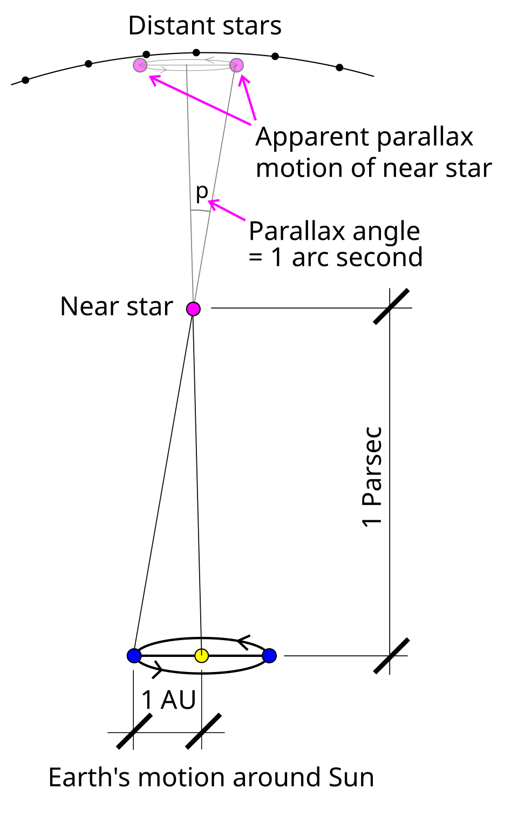

.. _numpy_stars:

NumPy Stars
===========

.. questions::

   - Why use NumPy instead of pure python?
   - How to use basic NumPy?
   - What is vectorization?

.. objectives::

   - Understand the Numpy array object
   - Be able to use basic NumPy functionality
   - Understand enough of NumPy to search for answers to the rest of your questions ;)

   We expect most people to be able to do all the basic exercises here.
   For those who are already familiar with the basics and desire something more challenging, we have more advanced exercises at the end.

.. admonition:: Example context
   :class: demo

   Each lesson is placed inside an example scientific setting.
   In this lesson, we will compute the distance of the stars in our night sky, using the data collected by the Gaia sattelite.

NumPy is the most used library for scientific computing.
Even if you are not using it directly, chances are high that some library uses it in the background.
It helps you work with "data", as in large amounts of numbers, by providing:

1. A high-performance multidimensional array object to store data in computer memory
2. Efficient routines to manipulate data, such as reading and writing, splitting and concatenation, and other transformations
3. Efficient routines to perform computations on data, such as statistics and linear algebra

Let's explore the fundamentals of this foundational library by analyzing some astronomical data.

.. highlight:: python

Exploring our local stellar neighbourhood
-----------------------------------------

The `Gaia sattelite <https://www.esa.int/Science_Exploration/Space_Science/Gaia>`__ has imaged around 1.8 billion stars and other objects.
Among the things it measured was the "parallax" of each object, which is how much it seems to "move" in relationship to very distant stars as the sattelite traveled around the sun and observed it from different angles.
We can use the amount of parallax to determine how far away a star is.

A sample of the Gaia data can be found in :download:`../resources/data/numpy/local_stars.csv`.
This is a *comma separated value (CSV)* file, where each line contains 6 numbers describing a single object.
The first line of that file is the "header" indicating the meaning of each number::

    with open("../resources/data/numpy/local_stars.csv") as f:
        # The file handle `f` acts as a generator that yields lines of text.
        first_line = next(f)  # take a single item from the generator
        names = first_line.split(",")  # split on commas to get a list of individual names
    print(names)

We can use one of NumPy's functions to load the entire file into memory::

    import numpy as np  # we usually use `np` as shorthand
    # We set `skip_header=1` to skip the first line containing the description of the values.
    data = np.genfromtxt("../resources/data/numpy/local_stars.csv", delimiter=",", skip_header=1)
    print(data)

The ``data`` variable is a NumPy array::

   print(type(data))
 

What is an array?
-----------------

An array is a "grid" of values, with all the same type, tightly packed into memory side-by-side.
This is why we skipped the first line of the file containing ``str`` type descriptions, so that we were only reading numbers.
In our case, the data type of the array is::

    print(data.dtype)

Arrays can have any number of dimensions::

    print(data.ndim)

You can think of a 1D array as a *list* and a 2D array as a *table*.
In mathematics, we call a 1D array a *vector*, a 2D array a *matrix*, and an array with 3 or even more dimensions a *tensor*.
An array can even have zero dimensions if it represents a single *scalar* number.
Regardless of how many dimensions the array has, it is always a Python object of type :class:`numpy.ndarray`.

Let's see how many stars we have::

    print(data.shape)

We have information on more than a million stars, and for each star we have 6 values, corresponding to (see ``names`` above):

0. ``right_ascention``: horizontal position of the star along the celestial equator (degrees)
#. ``declination``: vertical position of the star above/below celestial equator (degrees)
#. ``parallax``: amount the star's position in the sky changes throughout the year
#. ``magnitude_g``: how bright the star appears in our sky (inverse Logarithmic scale)
#. ``magnitude_red``: red-component of the color of the star
#. ``magnitude_blue``: blue-component of the color of the star

Working with arrays
-------------------

The way the array is laid out in memory makes it very fast to select portions of the data, by "indexing" or "slicing" the array.
You can index/slice arrays in a similar manner as Python lists, but you specify an index/slice for each dimension.
At the moment, we are only interested in the parallax value of each star, so let's extract that column and store it in a variable of its own::

    parallax = data[:, 2]  # `:` is a shorthand for "select everything along this dimension"
    print(parallax)

Now for some basic math.
The parallax values are currently in `milli-arc-seconds <https://en.wikipedia.org/wiki/Minute_and_second_of_arc>`__.
Let's convert that into distance.
A common distance metric is the `"parsec" <https://en.wikipedia.org/wiki/Parsec>`__, which is the distance at which an object has a parallax of exactly one arc-second, which is 3.26156 light-years::

    distance_parsecs = 1 / (parallax / 1000)  # 1000 milli-arc-seconds in an arc-second
    distance_ly = distance_parsecs * 3.26156

Note that we didn't write any ``for``-loops.
In NumPy, arithmetic operations on arrays are applied to every element in that array.
It is very fast, because it is implemented in C or Fortran and makes use of specialized CPU instructions that perform operations on many values at once.
We say an operation is "vectorized" when the looping over elements is carried out by NumPy internally.
Common mathematical operations include: ``+`` (:data:`numpy.add`), ``-`` (:data:`numpy.subtract`), ``*`` (:data:`numpy.multiply`), ``/`` (:data:`numpy.divide`), ``.T`` (:func:`numpy.transpose`), :data:`numpy.sqrt`, :func:`numpy.sum`, :func:`numpy.mean`, ...

.. note::
   In NumPy, ``*`` performs element-wise multiplication and ``@`` performs matrix multiplication. This is different from other languages such as MATLAB or Julia.

Let's examine the closest star in the dataset::

    distance_to_closest_star = distance_ly.min()  # returns the minimum value
    index_of_closest_star = distance_ly.argmin()  # returns the index of the minimum value
    print(distance_to_closest_star, index_of_closest_star)

The closest star is `Proxima Centauri <https://en.wikipedia.org/wiki/Proxima_Centauri>`__ at 4.2465 light-years.
To see all the information we have on it, we can select the entire row using the index we just obtained::

    print(names)  # the column names for reference
    print(data[index_of_closest_star, :])  # select the row corresponding to Proxima Centauri

NumPy has many other ways to select data.
For example, let's see if we can show some information on the 10 stars closest to us.
To do this, we must first order the stars by distance::

    order_by_distance = np.argsort(distance_parsecs)  # argsort returns indices, not values
    closest_indices = order_by_distance[:10]  # select the first 10 elements
    print(closest_indices)

We now have a list (technically a 1D numpy.array) of integer indices of the stars closest to us.
We can select multiple rows by indexing the array with such a list::

    closest_stars = data[closest_indices, :] 
    print(distance_ly[closest_indices])

Another powerful indexing technique is to create an index based on boolean values.
Recall that in Python, comparison operations (``==``, ``<``, ``<=``, ``>``, ``>=``) produce a boolean (``True``/``False``) value.
See what happens when you apply them to an array::

    closer_than_15_ly = distance_ly < 15
    print(closer_than_15_ly.shape)
    print(closer_than_15_ly[:10])

It produces a new array, of the same dimensions as the original array, but filled with ``True``/``False`` values indicating for each element whether the comparison holds true or not.
We call this a "boolean mask" and we can use it to index another array::

    print(distance_ly[closer_than_15_ly])
    print(data[closer_than_15_ly, :].shape)

Can we find the `Big Dipper <https://en.wikipedia.org/wiki/Ursa_Major>`__?
It lies within a section of the sky with a right ascention from 160 to 210 degrees, and a declination from 45 to 65 degrees::

    right_ascention = data[:, 0]
    declination = data[:, 1]
    boolean_mask = (
        (right_ascention > 160) & (right_ascention < 210) &
        (declination > 45) & (declination < 65)
    )
    sky_section = data[boolean_mask]
    print(sky_section.shape)

In our dataset, there are more than 15k stars in our chosen section of sky.
The Big Dipper should consist of the 7 brightest ones.
Column 3, named `magnitude_g` denotes bright the star looks as seen by the Gaia sattelite.
The `magnitude scale <https://en.wikipedia.org/wiki/Magnitude_(astronomy)>`__ works "in reverse", such that very bright stars have a magnitude of 1 and weaker stars have a larger magnitude.

.. code::
    order_by_magnitude = np.argsort(sky_section[:, 3])
    sky_section = sky_section[order_by_magnitude, :]
    big_dipper = sky_section[:7]

    # Make a figure with the position of the stars. We will cover this in a later lesson.
    fig, ax = plt.subplots()
    ax.scatter(big_dipper[:, 0], big_dipper[:, 1])
    ax.xaxis.set_inverted(True)
    ax.set_aspect("equal")
    ax.set_xlabel("right ascention (degrees)")
    ax.set_ylabel("declination (degrees)")

.. seealso::

   :ref:`Numpy basic indexing docs <basics.indexing>`

Clever and efficient use of these operations is a key to NumPy's speed: you should try to cleverly use these selectors (written in C) to extract data to be used with other NumPy functions written in C or Fortran.
This will give you the benefits of Python with most of the speed of C.

Exercises 1
-----------

.. challenge:: Exercises: Numpy-1

   Proxima Centauri is part of a 3-star system called `Alpha Centauri <https://en.wikipedia.org/wiki/Alpha_Centauri>`__.
   The other two stars are very close together and appear as a single object (Alpha Centauri AB) in this dataset.
   
   #. What is the row index of the binary star Alpha Centauri AB?
      It is the second closest star to us.
      What is the distance from us to Alpha Centauri AB?
   #. What is the distance from us to the brightest star in the dataset (`Sirius <https://en.wikipedia.org/wiki/Sirius>`__)?
   #. How many stars are there in the dataset that are even brighter than the brightest star in the Big Dipper (`Alioth <https://en.wikipedia.org/wiki/Alioth>`__)?

Creating arrays
---------------

Now we know how far stars are from us, but how far are stars from each other?
This is easier to answer if we transform the coordinates from Gaia-CRF (ra, dec, distance) in degrees -> Cartesian (x, y, z) in light-years.
Let's create a new 2D array of shape ``(n_stars, 3)`` with the Cartesian coordinates of each star, measured in light-years, with us at the center.

We can compute each coordinate using the trigonometry functions `np.sin` and `np.cos`.
These operate in radians, so we use `np.deg2rad()` to convert degrees to radians::

    x = distance_ly * np.cos(np.deg2rad(declination)) * np.cos(np.deg2rad(right_ascention))
    y = distance_ly * np.cos(np.deg2rad(declination)) * np.sin(np.deg2rad(right_ascention))
    z = distance_ly * np.sin(np.deg2rad(declination))

One of the many ways to create an array is to start with a Python list.
Now currently have three 1D arrays.
To create a 2D array out of them, we packing them into a Python list and then convert this list to an array::

    xyz_list = [x, y, z]
    xyz = np.array(xyz_list)
    print(xyz.shape)

This gives us an array with 3 rows and each star being a column.
To swap rows and columns is called the `Transpose <https://en.wikipedia.org/wiki/Transpose>`__ and is such a common operation, especially when doing linear algebra, that NumPy has a shorthand for it::

    xyz = xyz.T  # transpose the 2D array
    print(xyz.shape)

# Question: Alkaid and Mizar form the tail end of the "big dipper".
#           How far are these stars from one another?
#                                                  * Dubhe
#                * Mizar         Megrez
#               /         *         *
#    * Alkaid  /       Alioth                          * Merak
#     \       /                          *
#      \     /                         Phecda
#       \   /
#        \ /
#         * Sol
#
